# Testing

> [!NOTE]
> Return back to the [README.md](README.md) file.

## Code Validation

### HTML

I have used the recommended [HTML W3C Validator](https://validator.w3.org) to validate all of my HTML files.

| Directory | File | URL | Screenshot | Notes |
| --- | --- | --- | --- | --- |
| bag | [bag.html](https://github.com/MrsmLisa/Megadodo-Publications/blob/main/bag/templates/bag/bag.html) | [Link](https://validator.w3.org/nu/?doc=https%3A%2F%2Fmegadodo-publications-8e99ae98d78e.herokuapp.com%2Fbag%2F) | 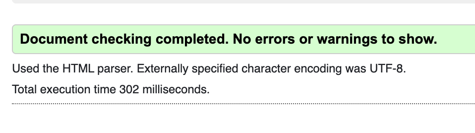 | |
| checkout | [checkout.html](https://github.com/MrsmLisa/Megadodo-Publications/blob/main/checkout/templates/checkout/checkout.html) | [Link](https://validator.w3.org/nu/?doc=https%3A%2F%2Fmegadodo-publications-8e99ae98d78e.herokuapp.com%2Fcheckout%2F) | 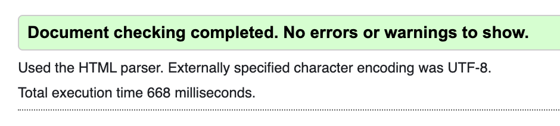 | |
| checkout | [checkout_success.html](https://github.com/MrsmLisa/Megadodo-Publications/blob/main/checkout/templates/checkout/checkout_success.html) | [Link](https://megadodo-publications-8e99ae98d78e.herokuapp.com/checkout/checkout_success/MDP-20260715-146F76/) | 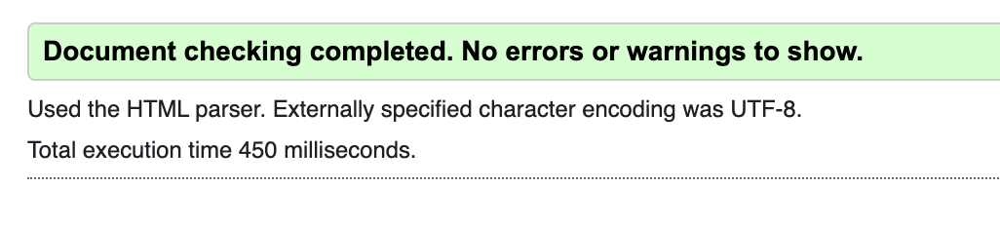 | Requires login — validated via page source |
| contact | [contact.html](https://github.com/MrsmLisa/Megadodo-Publications/blob/main/contact/templates/contact/contact.html) | [Link](https://validator.w3.org/nu/?doc=https%3A%2F%2Fmegadodo-publications-8e99ae98d78e.herokuapp.com%2Fcontact%2F) | 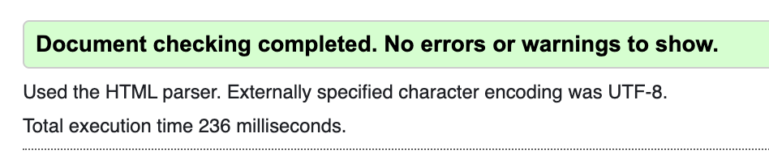 | |
| contact | [thank_you.html](https://github.com/MrsmLisa/Megadodo-Publications/blob/main/contact/templates/contact/thank_you.html) | [Link](https://validator.w3.org/nu/?doc=https%3A%2F%2Fmegadodo-publications-8e99ae98d78e.herokuapp.com%2Fcontact%2F) | 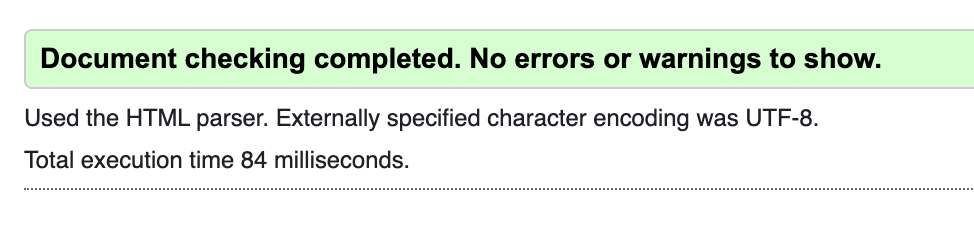 |  |
| forum | [forum.html](https://github.com/MrsmLisa/Megadodo-Publications/blob/main/forum/templates/forum/forum.html) | [Link](https://validator.w3.org/nu/?doc=https%3A%2F%2Fmegadodo-publications-8e99ae98d78e.herokuapp.com%2Fforum%2F) | 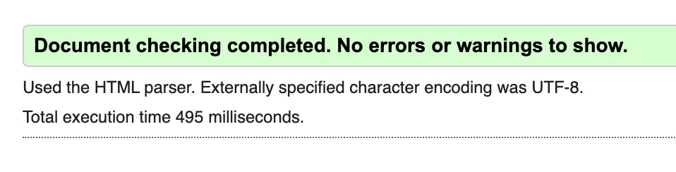 | |
| forum | [question_detail.html](https://github.com/MrsmLisa/Megadodo-Publications/blob/main/forum/templates/forum/question_detail.html) | [Link](https://validator.w3.org/nu/?doc=https%3A%2F%2Fmegadodo-publications-8e99ae98d78e.herokuapp.com%2Fforum%2Fquestion%2F4%2F) | 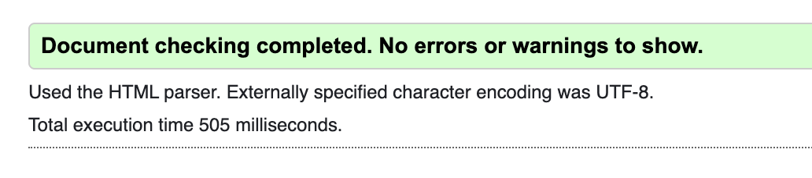 | |
| forum | [create_question.html](https://github.com/MrsmLisa/Megadodo-Publications/blob/main/forum/templates/forum/create_question.html) | [Link](https://validator.w3.org/nu/?doc=https%3A%2F%2Fmegadodo-publications-8e99ae98d78e.herokuapp.com%2Fforum%2Fquestion%2Fcreate%2F) | 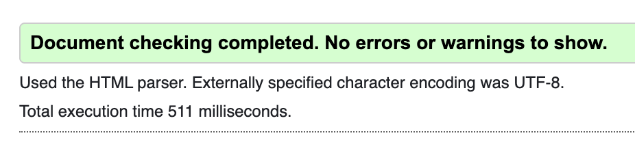 | Requires login |
| forum | [edit_question.html](https://github.com/MrsmLisa/Megadodo-Publications/blob/main/forum/templates/forum/edit_question.html) | [Link](https://megadodo-publications-8e99ae98d78e.herokuapp.com/forum/question/4/edit/) | 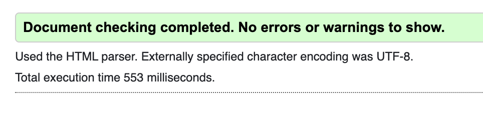 | Requires login |
| forum | [delete_question.html](https://github.com/MrsmLisa/Megadodo-Publications/blob/main/forum/templates/forum/delete_question.html) | [Link](https://validator.w3.org/nu/?doc=https%3A%2F%2Fmegadodo-publications-8e99ae98d78e.herokuapp.com%2Fforum%2Fquestion%2F4%2Fdelete%2F) |  | Requires login |
| forum | [edit_answer.html](https://github.com/MrsmLisa/Megadodo-Publications/blob/main/forum/templates/forum/edit_answer.html) | [Link](https://validator.w3.org/nu/?doc=https%3A%2F%2Fmegadodo-publications-8e99ae98d78e.herokuapp.com%2Fforum%2Fanswer%2F4%2Fedit%2F) | 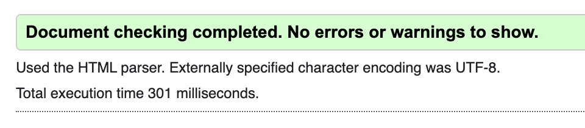 | Requires login |
| forum | [delete_answer.html](https://github.com/MrsmLisa/Megadodo-Publications/blob/main/forum/templates/forum/delete_answer.html) | [Link](https://validator.w3.org/nu/?doc=https%3A%2F%2Fmegadodo-publications-8e99ae98d78e.herokuapp.com%2Fforum%2Fanswer%2F4%2Fdelete%2F) | 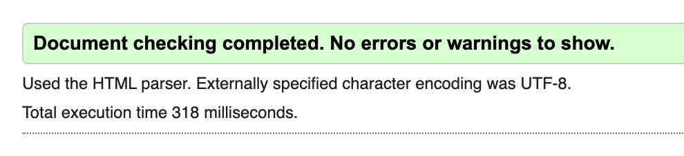 | Requires login |
| home | [index.html](https://github.com/MrsmLisa/Megadodo-Publications/blob/main/home/templates/home/index.html) | [Link](https://validator.w3.org/nu/?doc=https%3A%2F%2Fmegadodo-publications-8e99ae98d78e.herokuapp.com%2F) | 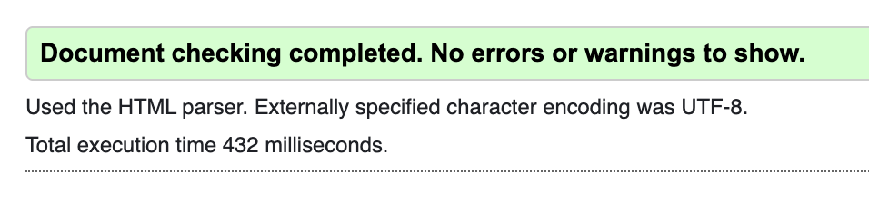 | |
| home | [about.html](https://github.com/MrsmLisa/Megadodo-Publications/blob/main/home/templates/home/about.html) | [Link](https://validator.w3.org/nu/?doc=https%3A%2F%2Fmegadodo-publications-8e99ae98d78e.herokuapp.com%2Fabout%2F) | 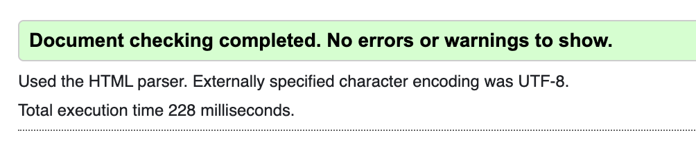 | |
| home | [delivery.html](https://github.com/MrsmLisa/Megadodo-Publications/blob/main/home/templates/home/delivery.html) | [Link](https://validator.w3.org/nu/?doc=https%3A%2F%2Fmegadodo-publications-8e99ae98d78e.herokuapp.com%2Fdelivery%2F) | 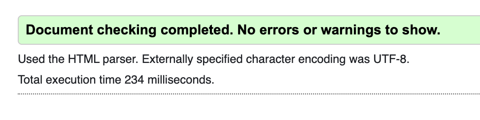 | |
| home | [terms.html](https://github.com/MrsmLisa/Megadodo-Publications/blob/main/home/templates/home/terms.html) | [Link](https://validator.w3.org/nu/?doc=https://megadodo-publications-8e99ae98d78e.herokuapp.com/terms/) |  | |
| products | [product_list.html](https://github.com/MrsmLisa/Megadodo-Publications/blob/main/products/templates/products/product_list.html) | [Link](https://validator.w3.org/nu/?doc=https://megadodo-publications-8e99ae98d78e.herokuapp.com/products/) | 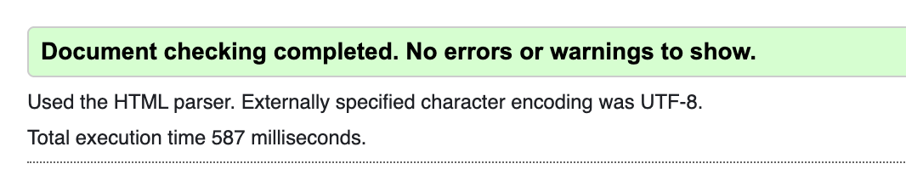 | |
| products | [product_detail.html](https://github.com/MrsmLisa/Megadodo-Publications/blob/main/products/templates/products/product_detail.html) | View Page Source | 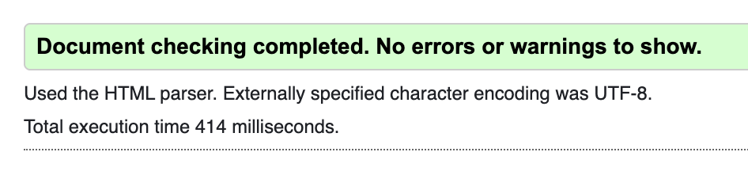 | |
| profiles | [profile.html](https://github.com/MrsmLisa/Megadodo-Publications/blob/main/profiles/templates/profiles/profile.html) | View Page Source | 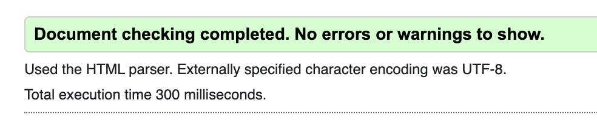 | Requires login |
| templates | [404.html](https://github.com/MrsmLisa/Megadodo-Publications/blob/main/templates/404.html) | View Page Source |  | |
| templates | [500.html](https://github.com/MrsmLisa/Megadodo-Publications/blob/main/templates/500.html) | View Page Source |  | |
| templates | [login.html](https://github.com/MrsmLisa/Megadodo-Publications/blob/main/templates/account/login.html) | [Link](https://validator.w3.org/nu/?doc=https://megadodo-publications-8e99ae98d78e.herokuapp.com/accounts/login/) | 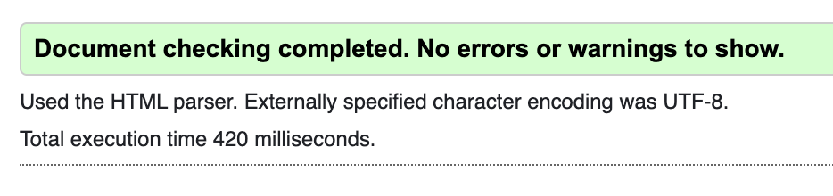 | |
| templates | [logout.html](https://github.com/MrsmLisa/Megadodo-Publications/blob/main/templates/account/logout.html) | View Page Source | 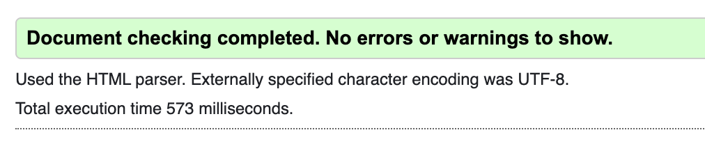 | Requires login |
| templates | [signup.html](https://github.com/MrsmLisa/Megadodo-Publications/blob/main/templates/account/signup.html) | [Link](https://validator.w3.org/nu/?doc=https://megadodo-publications-8e99ae98d78e.herokuapp.com/accounts/signup/) | 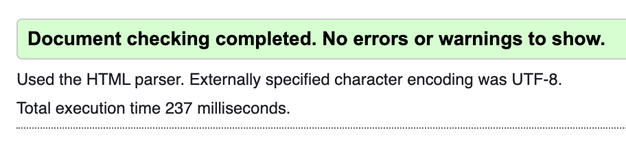 | |

### CSS

I have used the recommended [CSS Jigsaw Validator](https://jigsaw.w3.org/css-validator) to validate all of my CSS files.

| Directory | File | URL | Screenshot | Notes |
| --- | --- | --- | --- | --- |
| static | [core.css](https://github.com/MrsmLisa/Megadodo-Publications/blob/main/static/css/core.css) | [Link](https://jigsaw.w3.org/css-validator/validator?uri=https://megadodo-publications-8e99ae98d78e.herokuapp.com) | 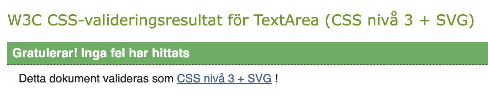 | |
| checkout | [checkout.css](https://github.com/MrsmLisa/Megadodo-Publications/blob/main/checkout/static/checkout/css/checkout.css) | Validate by input | 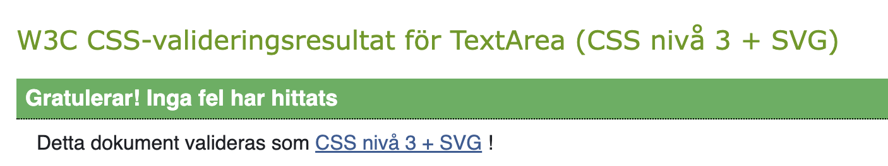 | |

### JavaScript

I have used the recommended [JShint Validator](https://jshint.com) to validate all of my JS files.

Add the following to the top of each JS file before validating:
```js
/* jshint esversion: 11, jquery: true */
```

| Directory | File | Screenshot | Notes |
| --- | --- | --- | --- |
| static | [base.js](https://github.com/MrsmLisa/Megadodo-Publications/blob/main/static/js/base.js) | 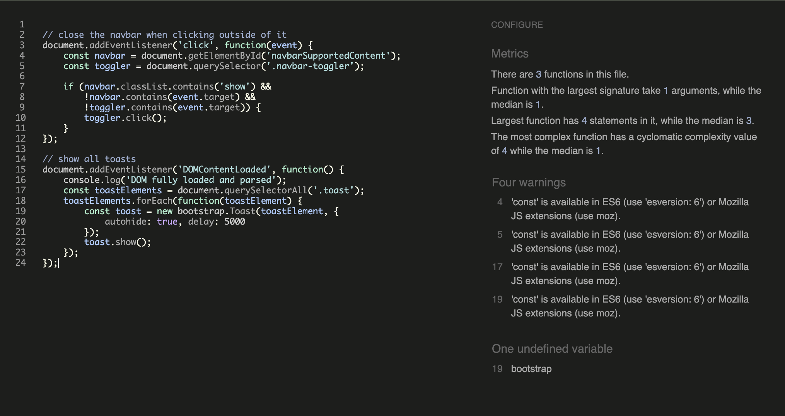 | |
| checkout | [stripe_elements.js](https://github.com/MrsmLisa/Megadodo-Publications/blob/main/checkout/static/checkout/js/stripe_elements.js) | 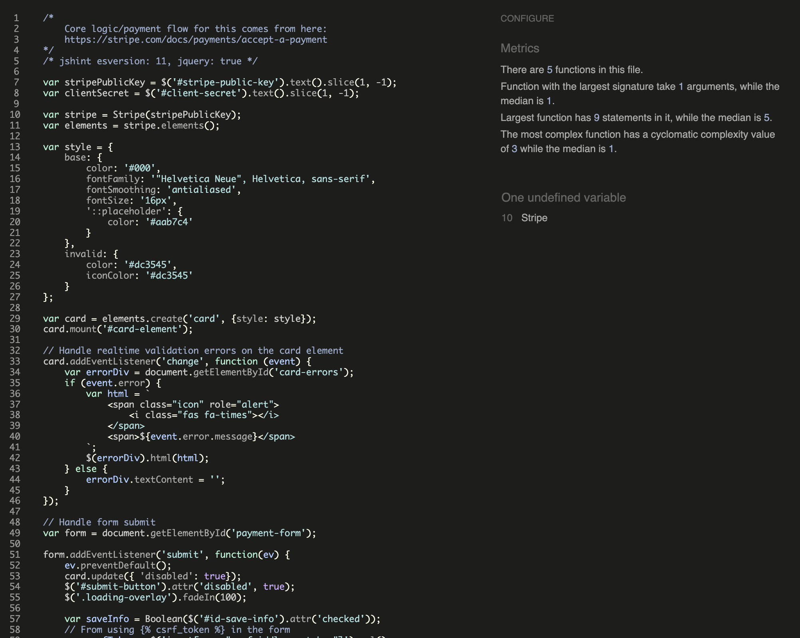 | `Stripe` and `$` flagged as undefined — expected when using external Stripe and jQuery libraries |

### Python

I have used the recommended [PEP8 CI Python Linter](https://pep8ci.herokuapp.com) to validate all of my Python files.

| Directory | File | URL | Screenshot | Notes |
| --- | --- | --- | --- | --- |
| bag | [admin.py](https://github.com/MrsmLisa/Megadodo-Publications/blob/main/bag/admin.py) | [PEP8 CI Link](https://pep8ci.herokuapp.com/https://raw.githubusercontent.com/MrsmLisa/Megadodo-Publications/main/bag/admin.py) | 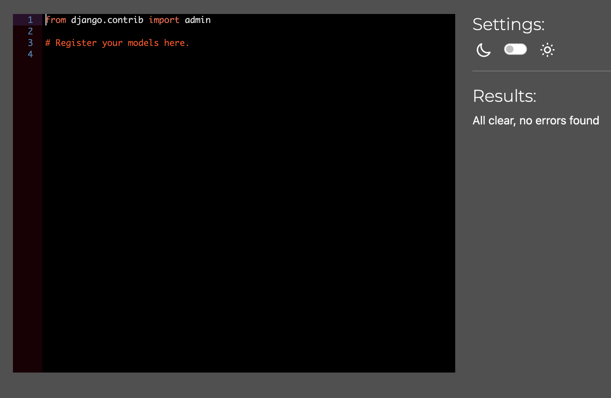 | |
| bag | [contexts.py](https://github.com/MrsmLisa/Megadodo-Publications/blob/main/bag/contexts.py) | [PEP8 CI Link](https://pep8ci.herokuapp.com/https://raw.githubusercontent.com/MrsmLisa/Megadodo-Publications/main/bag/contexts.py) | 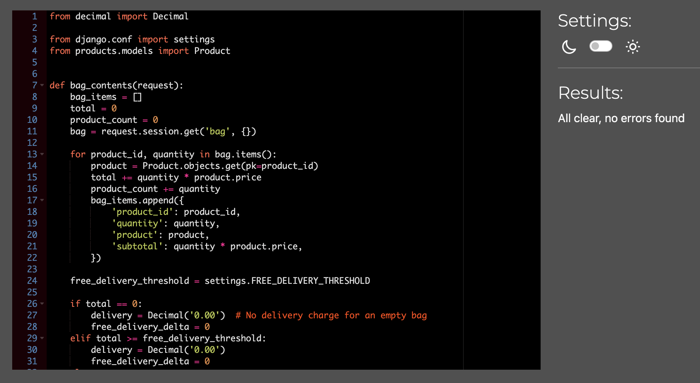 | |
| bag | [urls.py](https://github.com/MrsmLisa/Megadodo-Publications/blob/main/bag/urls.py) | [PEP8 CI Link](https://pep8ci.herokuapp.com/https://raw.githubusercontent.com/MrsmLisa/Megadodo-Publications/main/bag/urls.py) | 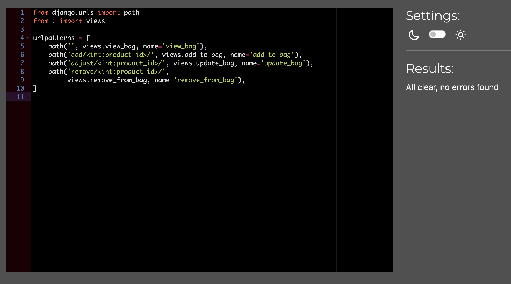 | |
| bag | [views.py](https://github.com/MrsmLisa/Megadodo-Publications/blob/main/bag/views.py) | [PEP8 CI Link](https://pep8ci.herokuapp.com/https://raw.githubusercontent.com/MrsmLisa/Megadodo-Publications/main/bag/views.py) | 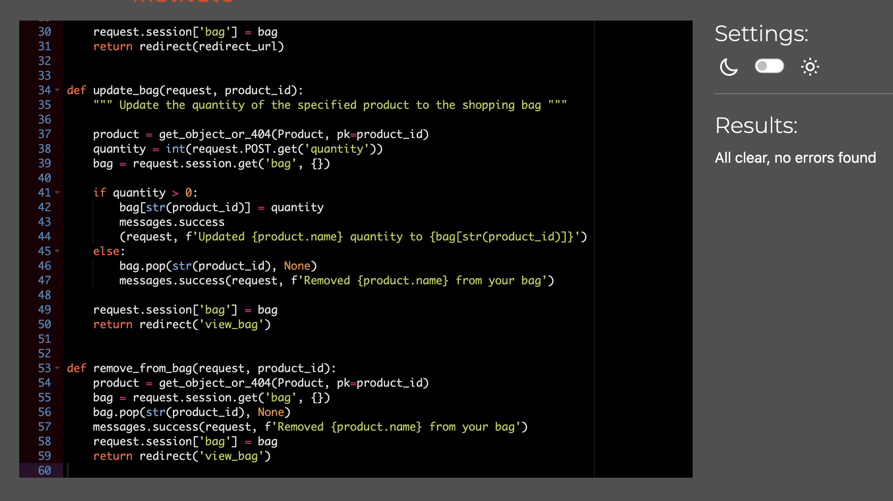 | |
| checkout | [admin.py](https://github.com/MrsmLisa/Megadodo-Publications/blob/main/checkout/admin.py) | [PEP8 CI Link](https://pep8ci.herokuapp.com/https://raw.githubusercontent.com/MrsmLisa/Megadodo-Publications/main/checkout/admin.py) | 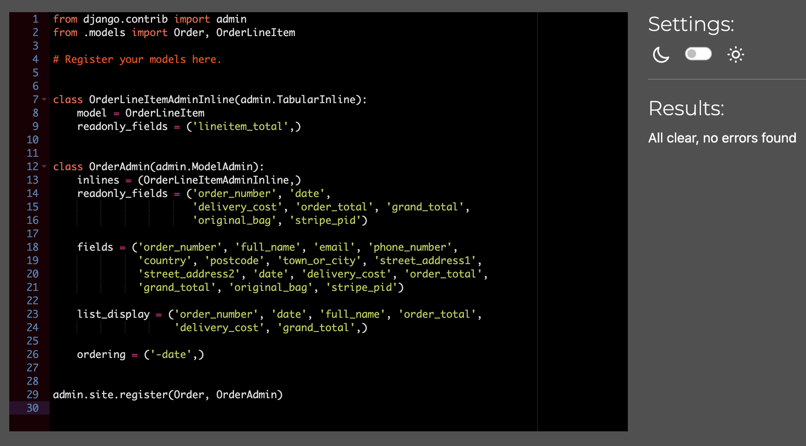 | |
| checkout | [forms.py](https://github.com/MrsmLisa/Megadodo-Publications/blob/main/checkout/forms.py) | [PEP8 CI Link](https://pep8ci.herokuapp.com/https://raw.githubusercontent.com/MrsmLisa/Megadodo-Publications/main/checkout/forms.py) | 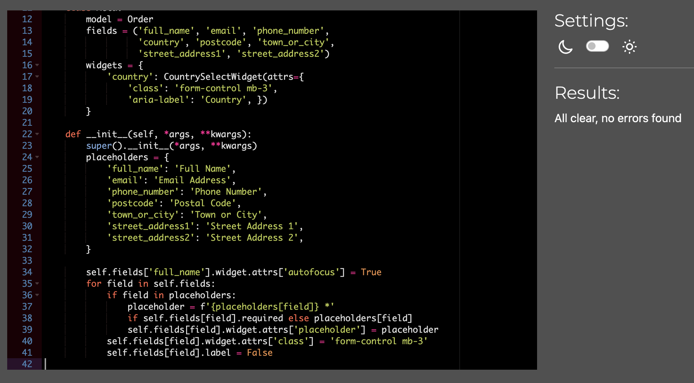 | |
| checkout | [models.py](https://github.com/MrsmLisa/Megadodo-Publications/blob/main/checkout/models.py) | [PEP8 CI Link](https://pep8ci.herokuapp.com/https://raw.githubusercontent.com/MrsmLisa/Megadodo-Publications/main/checkout/models.py) | 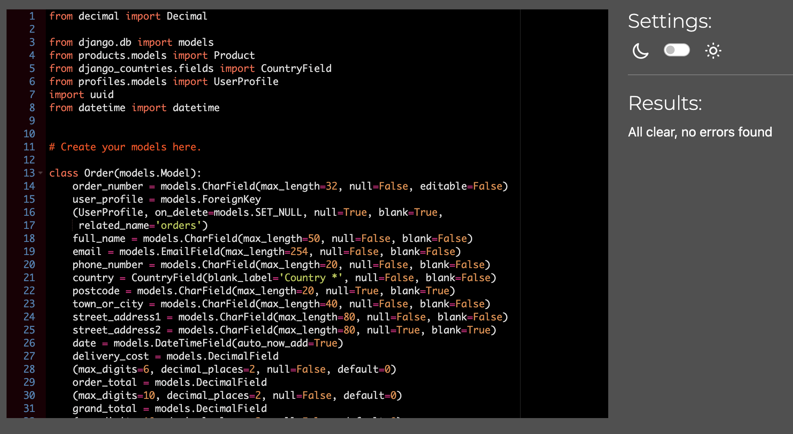 | |
| checkout | [signals.py](https://github.com/MrsmLisa/Megadodo-Publications/blob/main/checkout/signals.py) | [PEP8 CI Link](https://pep8ci.herokuapp.com/https://raw.githubusercontent.com/MrsmLisa/Megadodo-Publications/main/checkout/signals.py) | 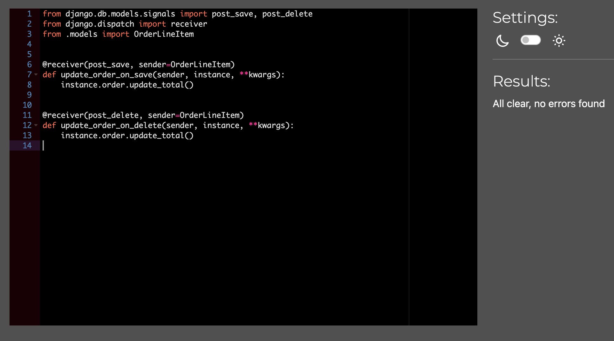 | |
| checkout | [urls.py](https://github.com/MrsmLisa/Megadodo-Publications/blob/main/checkout/urls.py) | [PEP8 CI Link](https://pep8ci.herokuapp.com/https://raw.githubusercontent.com/MrsmLisa/Megadodo-Publications/main/checkout/urls.py) | 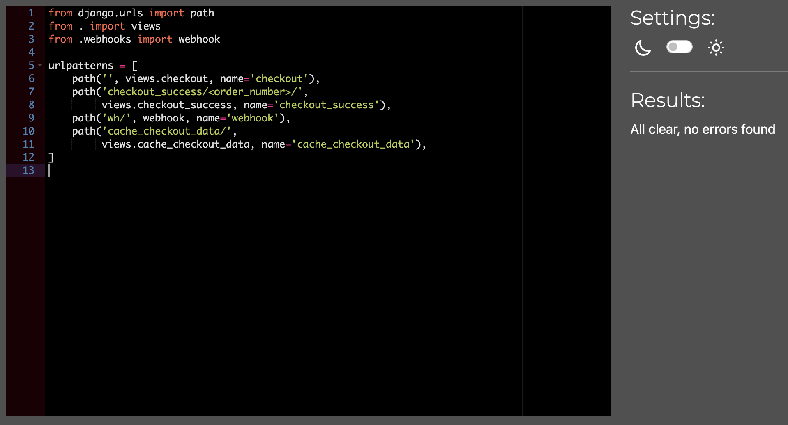 | |
| checkout | [views.py](https://github.com/MrsmLisa/Megadodo-Publications/blob/main/checkout/views.py) | [PEP8 CI Link](https://pep8ci.herokuapp.com/https://raw.githubusercontent.com/MrsmLisa/Megadodo-Publications/main/checkout/views.py) | 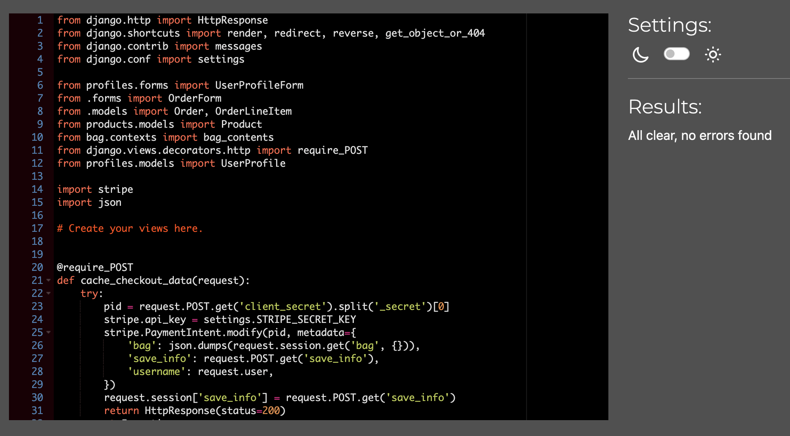 | |
| checkout | [webhook_handler.py](https://github.com/MrsmLisa/Megadodo-Publications/blob/main/checkout/webhook_handler.py) | [PEP8 CI Link](https://pep8ci.herokuapp.com/https://raw.githubusercontent.com/MrsmLisa/Megadodo-Publications/main/checkout/webhook_handler.py) | 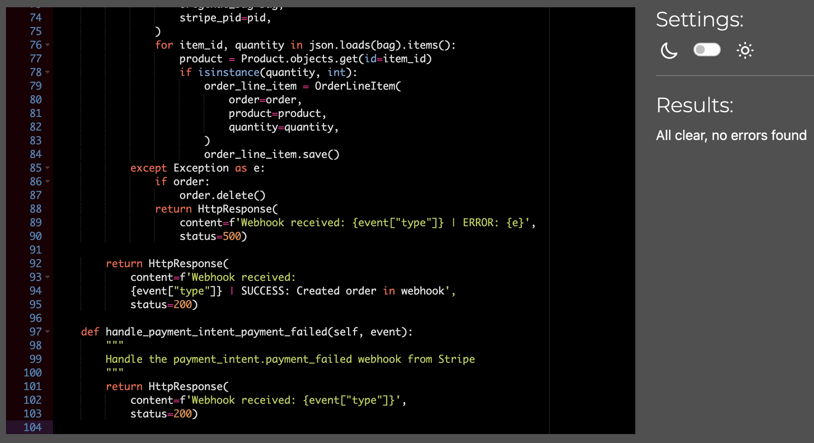 | |
| checkout | [webhooks.py](https://github.com/MrsmLisa/Megadodo-Publications/blob/main/checkout/webhooks.py) | [PEP8 CI Link](https://pep8ci.herokuapp.com/https://raw.githubusercontent.com/MrsmLisa/Megadodo-Publications/main/checkout/webhooks.py) | 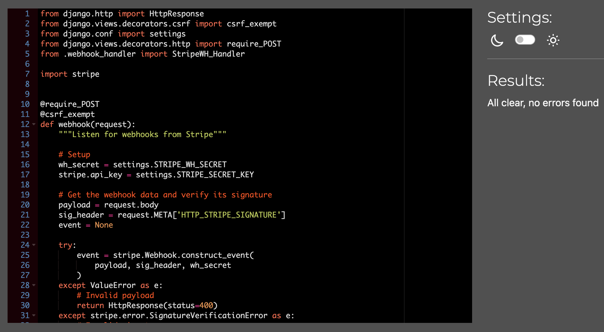 | |
| contact | [admin.py](https://github.com/MrsmLisa/Megadodo-Publications/blob/main/contact/admin.py) | [PEP8 CI Link](https://pep8ci.herokuapp.com/https://raw.githubusercontent.com/MrsmLisa/Megadodo-Publications/main/contact/admin.py) | 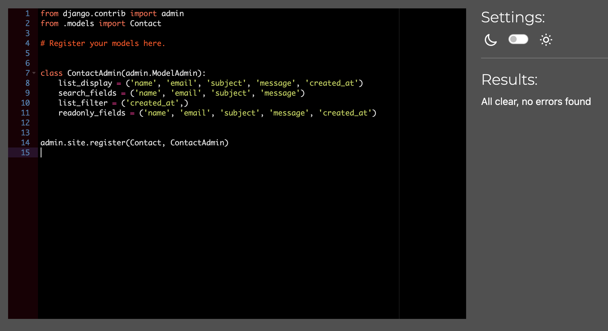 | |
| contact | [forms.py](https://github.com/MrsmLisa/Megadodo-Publications/blob/main/contact/forms.py) | [PEP8 CI Link](https://pep8ci.herokuapp.com/https://raw.githubusercontent.com/MrsmLisa/Megadodo-Publications/main/contact/forms.py) | 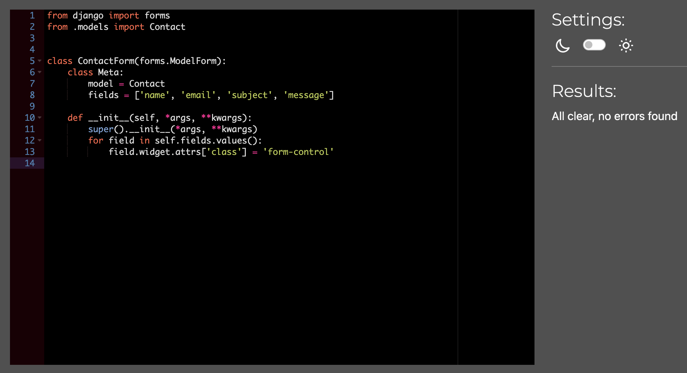 | |
| contact | [models.py](https://github.com/MrsmLisa/Megadodo-Publications/blob/main/contact/models.py) | [PEP8 CI Link](https://pep8ci.herokuapp.com/https://raw.githubusercontent.com/MrsmLisa/Megadodo-Publications/main/contact/models.py) | 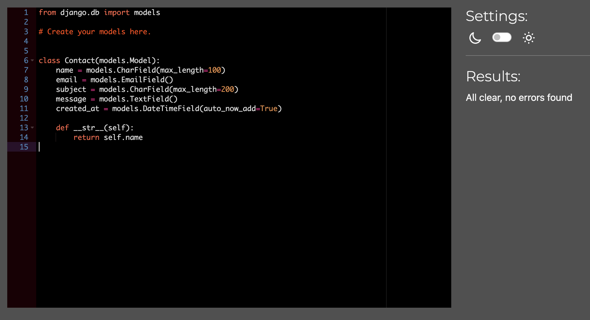 | |
| contact | [urls.py](https://github.com/MrsmLisa/Megadodo-Publications/blob/main/contact/urls.py) | [PEP8 CI Link](https://pep8ci.herokuapp.com/https://raw.githubusercontent.com/MrsmLisa/Megadodo-Publications/main/contact/urls.py) | 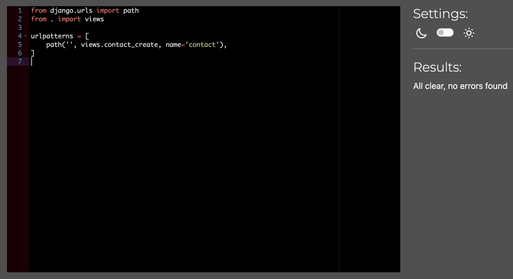 | |
| contact | [views.py](https://github.com/MrsmLisa/Megadodo-Publications/blob/main/contact/views.py) | [PEP8 CI Link](https://pep8ci.herokuapp.com/https://raw.githubusercontent.com/MrsmLisa/Megadodo-Publications/main/contact/views.py) | 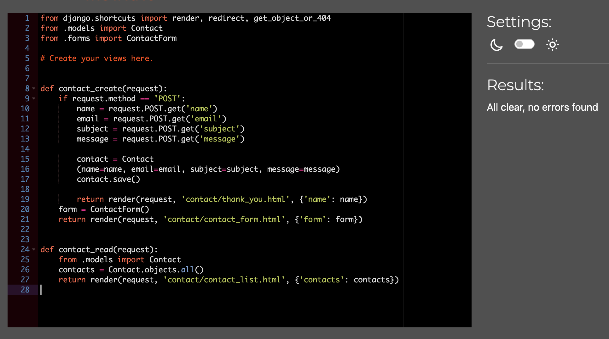 | |
| forum | [admin.py](https://github.com/MrsmLisa/Megadodo-Publications/blob/main/forum/admin.py) | [PEP8 CI Link](https://pep8ci.herokuapp.com/https://raw.githubusercontent.com/MrsmLisa/Megadodo-Publications/main/forum/admin.py) | 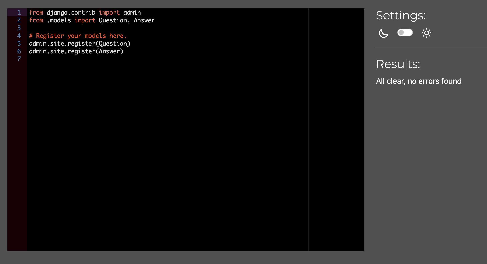 | |
| forum | [models.py](https://github.com/MrsmLisa/Megadodo-Publications/blob/main/forum/models.py) | [PEP8 CI Link](https://pep8ci.herokuapp.com/https://raw.githubusercontent.com/MrsmLisa/Megadodo-Publications/main/forum/models.py) | 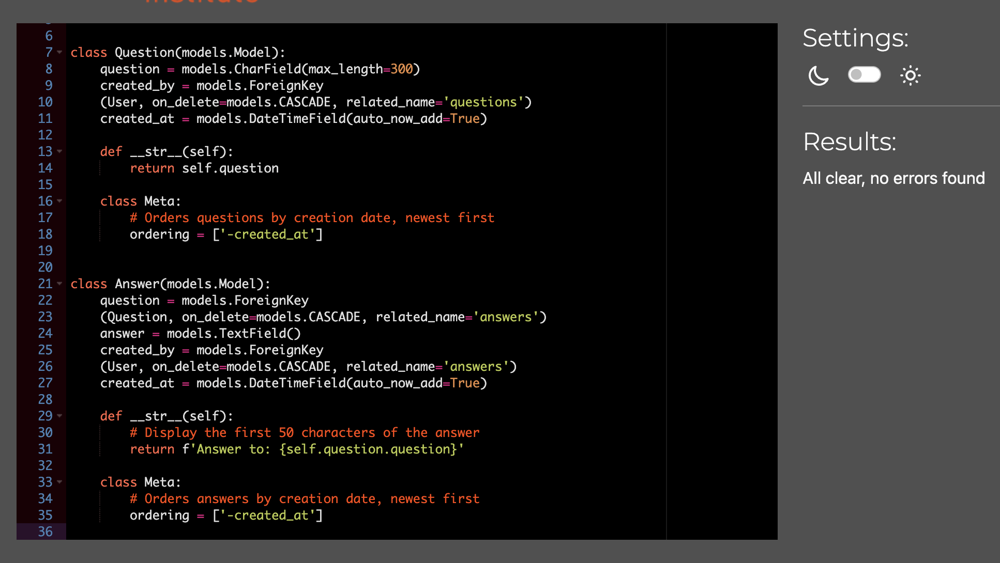 | |
| forum | [urls.py](https://github.com/MrsmLisa/Megadodo-Publications/blob/main/forum/urls.py) | [PEP8 CI Link](https://pep8ci.herokuapp.com/https://raw.githubusercontent.com/MrsmLisa/Megadodo-Publications/main/forum/urls.py) | 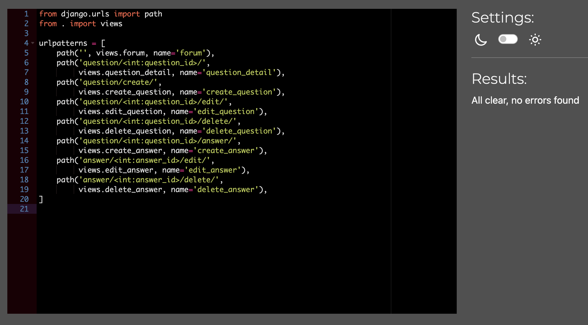 | |
| forum | [views.py](https://github.com/MrsmLisa/Megadodo-Publications/blob/main/forum/views.py) | [PEP8 CI Link](https://pep8ci.herokuapp.com/https://raw.githubusercontent.com/MrsmLisa/Megadodo-Publications/main/forum/views.py) | 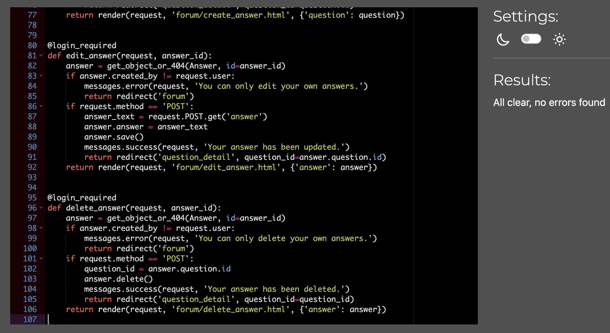 | |
| home | [models.py](https://github.com/MrsmLisa/Megadodo-Publications/blob/main/home/models.py) | [PEP8 CI Link](https://pep8ci.herokuapp.com/https://raw.githubusercontent.com/MrsmLisa/Megadodo-Publications/main/home/models.py) | 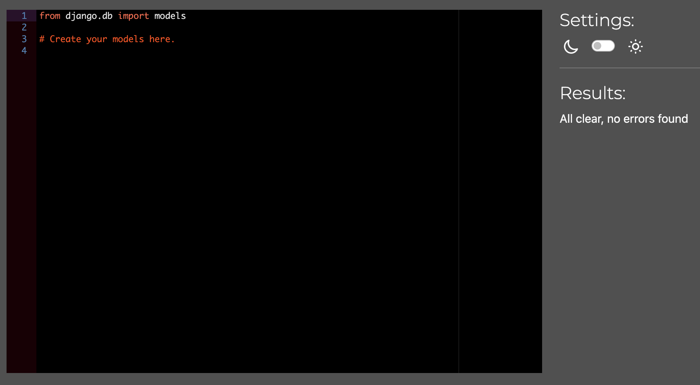 | |
| home | [urls.py](https://github.com/MrsmLisa/Megadodo-Publications/blob/main/home/urls.py) | [PEP8 CI Link](https://pep8ci.herokuapp.com/https://raw.githubusercontent.com/MrsmLisa/Megadodo-Publications/main/home/urls.py) | 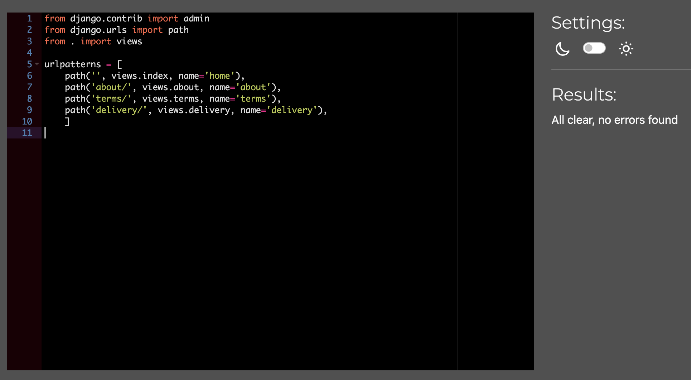 | |
| home | [views.py](https://github.com/MrsmLisa/Megadodo-Publications/blob/main/home/views.py) | [PEP8 CI Link](https://pep8ci.herokuapp.com/https://raw.githubusercontent.com/MrsmLisa/Megadodo-Publications/main/home/views.py) | 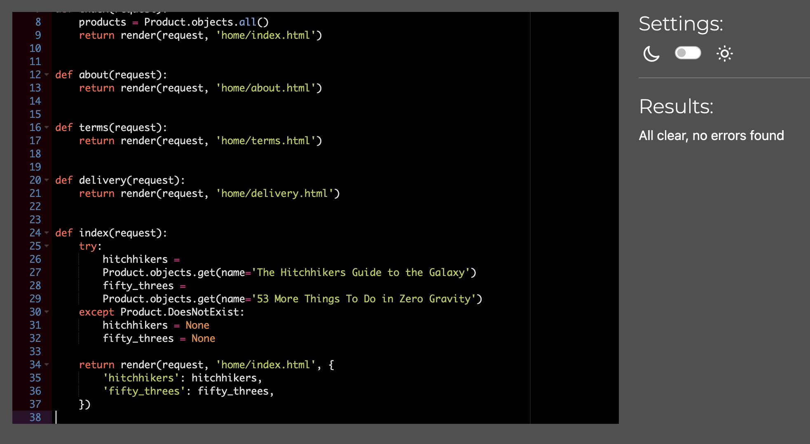 | |
| megadodo_publications | [settings.py](https://github.com/MrsmLisa/Megadodo-Publications/blob/main/megadodo_publications/settings.py) | [PEP8 CI Link](https://pep8ci.herokuapp.com/https://raw.githubusercontent.com/MrsmLisa/Megadodo-Publications/main/megadodo_publications/settings.py) | 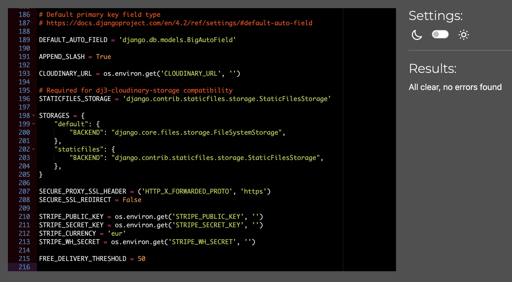 | Long lines in AUTH_PASSWORD_VALIDATORS use `# noqa` |
| megadodo_publications | [urls.py](https://github.com/MrsmLisa/Megadodo-Publications/blob/main/megadodo_publications/urls.py) | [PEP8 CI Link](https://pep8ci.herokuapp.com/https://raw.githubusercontent.com/MrsmLisa/Megadodo-Publications/main/megadodo_publications/urls.py) | 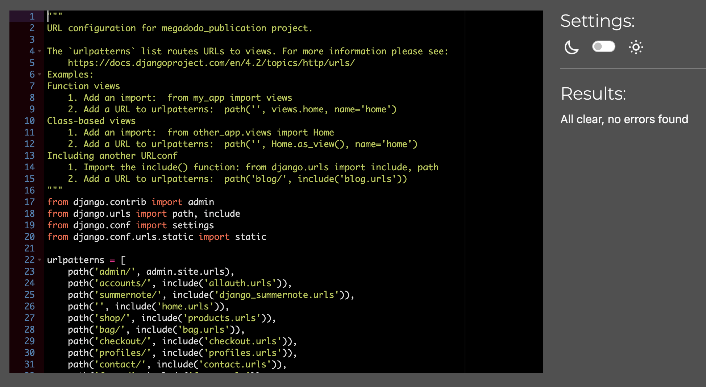 | |
| products | [admin.py](https://github.com/MrsmLisa/Megadodo-Publications/blob/main/products/admin.py) | [PEP8 CI Link](https://pep8ci.herokuapp.com/https://raw.githubusercontent.com/MrsmLisa/Megadodo-Publications/main/products/admin.py) |  | |
| products | [models.py](https://github.com/MrsmLisa/Megadodo-Publications/blob/main/products/models.py) | [PEP8 CI Link](https://pep8ci.herokuapp.com/https://raw.githubusercontent.com/MrsmLisa/Megadodo-Publications/main/products/models.py) |  | |
| products | [urls.py](https://github.com/MrsmLisa/Megadodo-Publications/blob/main/products/urls.py) | [PEP8 CI Link](https://pep8ci.herokuapp.com/https://raw.githubusercontent.com/MrsmLisa/Megadodo-Publications/main/products/urls.py) |  | |
| products | [views.py](https://github.com/MrsmLisa/Megadodo-Publications/blob/main/products/views.py) | [PEP8 CI Link](https://pep8ci.herokuapp.com/https://raw.githubusercontent.com/MrsmLisa/Megadodo-Publications/main/products/views.py) |  | |
| profiles | [admin.py](https://github.com/MrsmLisa/Megadodo-Publications/blob/main/profiles/admin.py) | [PEP8 CI Link](https://pep8ci.herokuapp.com/https://raw.githubusercontent.com/MrsmLisa/Megadodo-Publications/main/profiles/admin.py) |  | |
| profiles | [forms.py](https://github.com/MrsmLisa/Megadodo-Publications/blob/main/profiles/forms.py) | [PEP8 CI Link](https://pep8ci.herokuapp.com/https://raw.githubusercontent.com/MrsmLisa/Megadodo-Publications/main/profiles/forms.py) |  | |
| profiles | [models.py](https://github.com/MrsmLisa/Megadodo-Publications/blob/main/profiles/models.py) | [PEP8 CI Link](https://pep8ci.herokuapp.com/https://raw.githubusercontent.com/MrsmLisa/Megadodo-Publications/main/profiles/models.py) |  | |
| profiles | [urls.py](https://github.com/MrsmLisa/Megadodo-Publications/blob/main/profiles/urls.py) | [PEP8 CI Link](https://pep8ci.herokuapp.com/https://raw.githubusercontent.com/MrsmLisa/Megadodo-Publications/main/profiles/urls.py) |  | |
| profiles | [views.py](https://github.com/MrsmLisa/Megadodo-Publications/blob/main/profiles/views.py) | [PEP8 CI Link](https://pep8ci.herokuapp.com/https://raw.githubusercontent.com/MrsmLisa/Megadodo-Publications/main/profiles/views.py) |  | |
| | [manage.py](https://github.com/MrsmLisa/Megadodo-Publications/blob/main/manage.py) | [PEP8 CI Link](https://pep8ci.herokuapp.com/https://raw.githubusercontent.com/MrsmLisa/Megadodo-Publications/main/manage.py) |  | |

## Responsiveness

I've tested my deployed project to check for responsiveness issues.

| Page | Mobile | Tablet | Desktop | Notes |
| --- | --- | --- | --- | --- |
| Home |  |  |  | Works as expected |
| Products |  |  |  | Works as expected |
| Product Detail |  |  |  | Works as expected |
| Bag |  |  |  | Works as expected |
| Checkout |  |  |  | Works as expected |
| Checkout Success |  |  |  | Works as expected |
| Profile |  |  |  | Works as expected |
| Forum |  |  |  | Works as expected |
| Contact |  |  |  | Works as expected |
| Register |  |  |  | Works as expected |
| Login |  |  |  | Works as expected |
| 404 |  |  |  | Works as expected |

## Browser Compatibility

I've tested my deployed project on multiple browsers to check for compatibility issues.

| Page | Chrome | Firefox | Safari | Notes |
| --- | --- | --- | --- | --- |
| Home |  |  |  | Works as expected |
| Products |  |  |  | Works as expected |
| Product Detail |  |  |  | Works as expected |
| Bag |  |  |  | Works as expected |
| Checkout |  |  |  | Works as expected |
| Checkout Success |  |  |  | Works as expected |
| Profile |  |  |  | Works as expected |
| Forum |  |  |  | Works as expected |
| Contact |  |  |  | Works as expected |
| Register |  |  |  | Works as expected |
| Login |  |  |  | Works as expected |
| 404 |  |  |  | Works as expected |

## Lighthouse Audit

I've tested my deployed project using the Lighthouse Audit tool to check for any major issues. Some warnings are outside of my control, particularly the unused CSS warning from Bootstrap which is a known issue with using CDN-hosted CSS frameworks.

| Page | Mobile | Desktop |
| --- | --- | --- |
| Home |  |  |
| Products |  |  |
| Product Detail |  |  |
| Bag |  |  |
| Checkout |  |  |
| Checkout Success |  |  |
| Profile |  |  |
| Forum |  |  |
| Contact |  |  |
| Register |  |  |
| Login |  |  |
| 404 |  |  |

## Defensive Programming

Defensive programming was manually tested with the below user acceptance testing:

| Page | Expectation | Test | Result | Screenshot |
| --- | --- | --- | --- | --- |
| Products | Feature is expected to allow users to browse products without registration. | Opened product pages as a guest user. | Products were fully accessible without requiring registration. |  |
| Products | Feature is expected to allow users to search for products by name or description. | Entered search terms in the search box. | Search results displayed correctly matching the search term. |  |
| Product Detail | Feature is expected to show detailed product information. | Clicked on individual products to view details. | Product details including description, price and image were displayed correctly. |  |
| Shopping Bag | Feature is expected to allow customers to add items to the bag. | Added products to the bag from both product list and detail pages. | Items were added successfully and bag total updated in the navbar. |  |
| Shopping Bag | Feature is expected to allow customers to update and remove items. | Updated quantities and removed items from the bag. | Bag contents were updated and totals recalculated correctly. |  |
| Checkout | Feature is expected to display bag items, grand total and input fields for checkout. | Proceeded to checkout with items in the bag. | Checkout page displayed cart items, total and input fields as expected. |  |
| Checkout | Feature is expected to prefill delivery info for logged in users. | Logged in and proceeded to checkout. | Delivery information was prefilled from the user profile. |  |
| Checkout | Feature is expected to allow secure payment via Stripe. | Entered valid test card details at checkout. | Payment was processed securely and an order confirmation page was displayed. |  |
| Checkout | Feature is expected to handle declined payments gracefully. | Entered declined test card `4000 0000 0000 0002`. | Error message displayed clearly and form remained active for retry. |  |
| Order Confirmation | Feature is expected to display an order confirmation with order number. | Completed a purchase. | Order confirmation page displayed successfully with a unique order number. |  |
| Profile | Feature is expected to allow returning customers to log in and view past orders. | Logged in as a returning customer and accessed order history. | Past orders were displayed correctly in the profile. |  |
| Profile | Feature is expected to allow users to update their delivery information. | Updated default delivery address in profile. | Changes were saved and prefilled at next checkout. |  |
| Forum | Feature is expected to allow registered users to post questions. | Posted a question as a logged in user. | Question was saved and displayed on the forum page. |  |
| Forum | Feature is expected to allow registered users to answer questions. | Posted an answer to a question. | Answer was saved and displayed on the question detail page. |  |
| Forum | Feature is expected to prevent users from editing or deleting other users content. | Attempted to access edit URL for another user's question. | Redirected with an error message — content not modified. |  |
| Forum | Feature is expected to require login to post questions or answers. | Attempted to access create question page as a guest. | Redirected to login page. |  |
| Contact | Feature is expected to allow users to submit contact messages. | Submitted a contact form with valid details. | Message was saved to the database and thank you page displayed. |  |
| Contact | Feature is expected to validate required fields. | Submitted an empty contact form. | Form validation prevented submission and highlighted required fields. |  |
| 404 | Feature is expected to display a custom 404 error page for non-existent pages. | Navigated to an invalid URL (`/test/`). | Custom 404 page was displayed as expected. |  |
| Authentication | Feature is expected to prevent non-authenticated users from accessing protected pages. | Attempted to access `/profiles/` without logging in. | Redirected to login page. |  |
| Authentication | Feature is expected to prevent users accessing other users data. | Attempted to access another user's order history URL. | Access denied — only own orders displayed in profile. |  |

## User Story Testing

| Target | Expectation | Outcome | Screenshot |
| --- | --- | --- | --- |
| As a guest user | I would like to browse products without needing to register | so that I can shop freely before deciding to create an account. |  |
| As a guest user | I would like to add items to my bag and checkout without registering | so that I can complete my purchase quickly. |  |
| As a guest user | I would like to view product details including description, price and image | so that I can make an informed decision about my purchase. |  |
| As a guest user | I would like to search for products by name or description | so that I can quickly find what I am looking for. |  |
| As a guest user | I would like to see a 404 error page if I get lost | so that it is obvious I have stumbled upon a page that does not exist. |  |
| As a customer | I would like to add items to my shopping bag | so that I can collect products before checking out. |  |
| As a customer | I would like to view and manage my shopping bag | so that I can review, update quantities or remove items before checkout. |  |
| As a customer | I would like to proceed to checkout with my bag items and total clearly displayed | so that I know exactly what I am paying for. |  |
| As a customer | I would like to securely enter my card details using Stripe | so that I can feel confident my payment information is protected. |  |
| As a customer | I would like to receive an order confirmation page after my purchase | so that I know my order has been successfully placed. |  |
| As a customer | I would like to get free delivery on orders over €50 | so that I am rewarded for larger purchases. |  |
| As a registered user | I would like to create an account | so that I can access order history and save my delivery information. |  |
| As a registered user | I would like to log in and out easily | so that I can access my account securely. |  |
| As a registered user | I would like the checkout to prefill with my saved delivery information | so that future purchases are quicker and easier. |  |
| As a registered user | I would like to view my past orders | so that I can track my previous purchases. |  |
| As a registered user | I would like to update my default delivery information | so that I can keep my profile up to date. |  |
| As a registered user | I would like to submit a contact message | so that I can get in touch with the team. |  |
| As a registered user | I would like to post a question in the forum | so that I can get help from the community. |  |
| As a registered user | I would like to answer other users questions in the forum | so that I can contribute to the community. |  |
| As a registered user | I would like to edit or delete my own questions and answers | so that I can manage my forum contributions. |  |
| As a site owner | I would like to manage products through the admin panel | so that I can add, edit and delete products and categories. |  |
| As a site owner | I would like to view all orders placed on the site | so that I can track and manage customer purchases. |  |
| As a site owner | I would like to view all contact messages | so that I can respond to customer enquiries. |  |
| As a site owner | I would like to moderate the forum | so that I can manage questions and answers across the site. |  |

## Automated Testing

I have conducted a series of automated tests on my application.

> [!NOTE]
> I fully acknowledge and understand that, in a real-world scenario, an extensive set of additional tests would be more comprehensive.

### Python (Unit Testing)

I have used Django's built-in unit testing framework to test the application functionality.

To run the tests, use the following command:

```bash
python3 manage.py test name-of-app
```

| App | Test File | Screenshot | Notes |
| --- | --- | --- | --- |
| bag | [tests.py](https://github.com/MrsmLisa/Megadodo-Publications/blob/main/bag/tests.py) |  | |
| checkout | [tests.py](https://github.com/MrsmLisa/Megadodo-Publications/blob/main/checkout/tests.py) |  | |
| contact | [tests.py](https://github.com/MrsmLisa/Megadodo-Publications/blob/main/contact/tests.py) |  | |
| forum | [tests.py](https://github.com/MrsmLisa/Megadodo-Publications/blob/main/forum/tests.py) |  | |
| home | [tests.py](https://github.com/MrsmLisa/Megadodo-Publications/blob/main/home/tests.py) |  | |
| products | [tests.py](https://github.com/MrsmLisa/Megadodo-Publications/blob/main/products/tests.py) |  | |
| profiles | [tests.py](https://github.com/MrsmLisa/Megadodo-Publications/blob/main/profiles/tests.py) |  | |

## Bugs

### Fixed Bugs

| Bug | Fix |
| --- | --- |
| Static files not loading on Heroku after deployment | `cloudinary_storage` in `INSTALLED_APPS` was intercepting and breaking Django's `collectstatic` command, resulting in 0 files copied. Removing `cloudinary_storage` from `INSTALLED_APPS` while keeping the `cloudinary` package resolved the issue. The `staticfiles/` folder was added to version control to ensure persistence across deployments. |
| `os.environ.setdefault` split across two lines in `manage.py` | The arguments were on separate lines which meant the function was never actually called. Django could not find the settings module causing `No Django settings specified` error. Fixed by moving both arguments onto the same line. |
| Cloudinary `Invalid Signature` error on image upload | A hidden character was present in the API secret when copied from the Cloudinary dashboard. Identified using `repr()` in the Django shell. Copying the secret fresh resolved the issue. |
| `instance=review` in `review_create` view causing `UnboundLocalError` | `instance` is only needed when editing an existing object. Removed from the create view. |
| Product images not loading on Heroku | Cloudinary was configured but images uploaded through admin were being stored on Heroku's ephemeral filesystem. Switched to using `CloudinaryField` directly in the Product model which routes images through Cloudinary correctly. |
| Page shifting horizontally due to scrollbar | On Windows the scrollbar takes up space and shifts content. Fixed by adding `scrollbar-gutter: stable` to the HTML element. |
| Bag showing €4.99 delivery when empty | Delivery cost was calculated even when the bag total was €0. Added a check for `total == 0` to set delivery to €0 when the bag is empty. |
| Forum login link causing 500 error for guest users | Template was using `` instead of ``. Fixed the URL reference. |
| `order_form` being overwritten by empty form after prefill | In the checkout view, an empty `OrderForm()` was being instantiated after the prefilled form, overwriting it. Removed the redundant instantiation. |

### Unfixed Bugs

> [!NOTE]
> There are no remaining unfixed bugs that I am aware of. The Lighthouse performance warning about unused CSS from Bootstrap and Font Awesome CDN files is outside of my control and has been noted as a future improvement in the README.